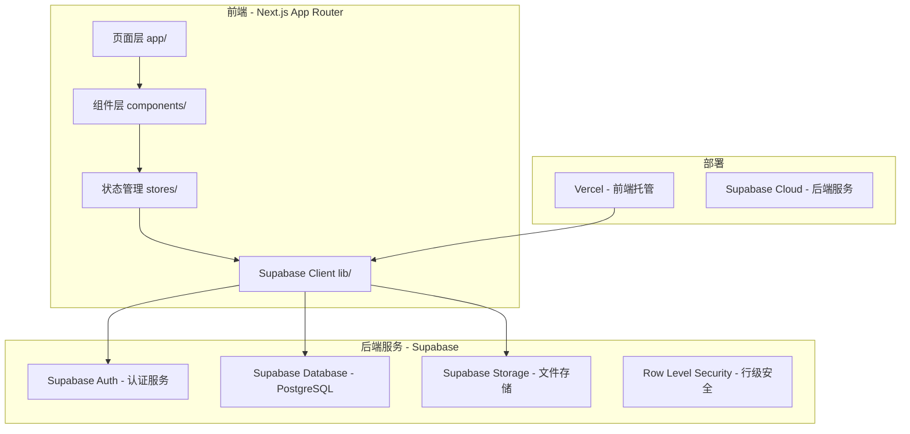
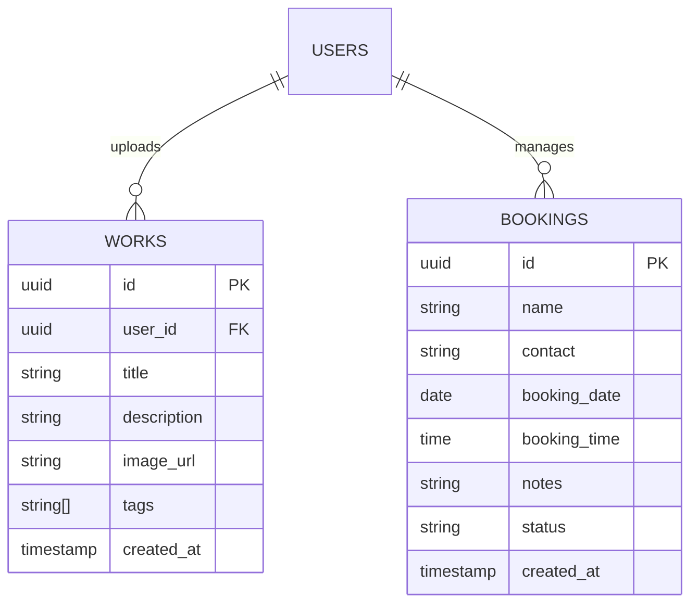

# 二次元摄影师预约展示网站 - 技术架构文档

## 1. 架构设计



## 2. 技术描述

- **前端框架**：Next.js 14+ (App Router) + React 18 + TypeScript
- **样式方案**：Tailwind CSS 3
- **状态管理**：Zustand（客户端状态）+ React Context（认证状态）
- **后端服务**：Supabase（认证 + PostgreSQL 数据库 + 文件存储）
- **图标库**：lucide-react
- **部署平台**：Vercel（前端）+ Supabase Cloud（后端）

## 3. 路由定义

| 路由 | 用途 | 权限 |
|------|------|------|
| / | 首页作品画廊 | 公开 |
| /gallery/[id] | 作品详情 | 公开 |
| /booking | 预约页面 | 公开 |
| /admin | 后台首页概览 | 需登录 |
| /admin/works | 作品管理 | 需登录 |
| /admin/bookings | 预约管理 | 需登录 |
| /admin/login | 后台登录 | 公开 |

## 4. 数据模型

### 4.1 ER 图



### 4.2 DDL

```sql
-- 作品表
CREATE TABLE public.works (
  id UUID PRIMARY KEY DEFAULT gen_random_uuid(),
  user_id UUID NOT NULL REFERENCES auth.users(id) ON DELETE CASCADE,
  title TEXT NOT NULL,
  description TEXT DEFAULT '',
  image_url TEXT NOT NULL,
  tags TEXT[] DEFAULT '{}',
  created_at TIMESTAMPTZ NOT NULL DEFAULT now()
);

-- 预约表
CREATE TABLE public.bookings (
  id UUID PRIMARY KEY DEFAULT gen_random_uuid(),
  name TEXT NOT NULL,
  contact TEXT NOT NULL,
  booking_date DATE NOT NULL,
  booking_time TIME NOT NULL,
  notes TEXT DEFAULT '',
  status TEXT NOT NULL DEFAULT 'pending' CHECK (status IN ('pending', 'confirmed', 'completed', 'cancelled')),
  created_at TIMESTAMPTZ NOT NULL DEFAULT now()
);

-- 索引
CREATE INDEX idx_works_user_id ON public.works(user_id);
CREATE INDEX idx_works_created_at ON public.works(created_at DESC);
CREATE INDEX idx_bookings_booking_date ON public.bookings(booking_date DESC);
CREATE INDEX idx_bookings_status ON public.bookings(status);
```

## 5. 安全策略（RLS）

```sql
-- 启用 RLS
ALTER TABLE public.works ENABLE ROW LEVEL SECURITY;
ALTER TABLE public.bookings ENABLE ROW LEVEL SECURITY;

-- 作品 RLS
CREATE POLICY "Everyone can read works" ON public.works
  FOR SELECT USING (true);

CREATE POLICY "Authenticated users can insert works" ON public.works
  FOR INSERT WITH CHECK (auth.uid() = user_id);

CREATE POLICY "Authenticated users can update own works" ON public.works
  FOR UPDATE USING (auth.uid() = user_id);

CREATE POLICY "Authenticated users can delete own works" ON public.works
  FOR DELETE USING (auth.uid() = user_id);

-- 预约 RLS
CREATE POLICY "Everyone can insert bookings" ON public.bookings
  FOR INSERT WITH CHECK (true);

CREATE POLICY "Everyone can read own bookings" ON public.bookings
  FOR SELECT USING (true);

CREATE POLICY "Authenticated users can update bookings" ON public.bookings
  FOR UPDATE USING (auth.role() = 'authenticated');

CREATE POLICY "Authenticated users can delete bookings" ON public.bookings
  FOR DELETE USING (auth.role() = 'authenticated');
```

## 6. Storage 配置

```sql
-- 创建存储桶
-- 在 Supabase Dashboard > Storage 中创建名为 "works" 的公开存储桶

-- Storage RLS 策略
CREATE POLICY "Everyone can read works" ON storage.objects
  FOR SELECT USING (bucket_id = 'works');

CREATE POLICY "Authenticated users can upload works" ON storage.objects
  FOR INSERT WITH CHECK (bucket_id = 'works' AND auth.role() = 'authenticated');

CREATE POLICY "Authenticated users can delete own works" ON storage.objects
  FOR DELETE USING (bucket_id = 'works' AND auth.uid() = owner);
```
